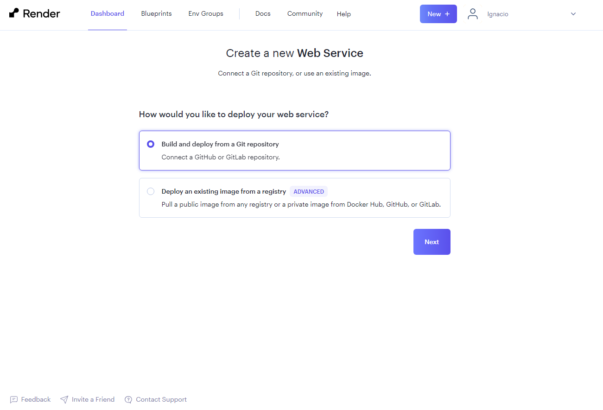

## Primeros pasos

En la carpeta principal del proyecto creamos un archivo de entrada a nuestra aplicación con el nombre **_index.js_**

### Codigo de index.js

```js
const http = require("http");

function requestController() {
  // lógica de nuestra función
  console.log("hola nuevo mundo");
}

// configuración del servidor
const server = http.createServer(requestController);

server.listen(4000);
```

## Preconfiguración para Git

Un repositorio es un alojamiento en la nuve de nuestro codigo para el tratamiento de versiones. Github nos da un servicio de alojamiento y gestion de versionado para nuestro proyecto. De tal manera que segun el cambio que se efectue se indicara una versión distinta.

El versionado gestiona tres niveles **_1.0.0_**. De tal modo que ante los cambios menores se aumenta la el numero de la version de la derecha. Un cambio mayor se aumenta la vesion del centro, que vendria a ser la **minor** del proyecto, y ante un cambio importante se aumenta la versión de la izquierda, que vendria a ser la **mayor** del proyecto.

Pasos a seguir:

- primero inicializamos git:

```
  git init
```

- seguido añadimos los archivos de nuestro proyecto al gestor para que podamos "commitearlos":

```
  git add .
```

- y por ultimo los "commiteamos" para su posterior subida al repositorio:

```
  git commit -m "primer commit"
```

Vamos a explicar brevemente que hemos hecho:

Cada vez que cambiamos un archivo de nuestro codigo en la maquina de trabajo o del lado del desarrollador, tambien llamado **\*local**, necesitamos subir este cambio al repositodiro o "almacen" de nuestro código.

Pero no siempre voy a subir, o no necesariamente puedo querer subir todos los cambios, por lo que tengo que indicar que quiero subir al repositorio por medio del comando **_git add_** y seguido el nombre o la lista de los archivos que voy a subir. Si deseo subir todos los cambios usaria **_git add ._**.

Seguidamente tengo que preparar los archivos que he indicado para subirlos al repositorio. Para ello realizare un _commit_ usando el comando **_git commit_** Pero ademas, si quiero incluir un comentario para indicar porque hago esta subida al repositorio necesito añadir **_-m "comantario"_**, quedando el codigo que tengo que usar como se indica arriba. Cabe destacar que puedo "acumular" tantos commits como desee. pero por seguridad siempre es mejor acumular pocos o uno.

Por ultimo necesito subir todo al repositorio. Para ello utilizare un el comando **_git push_**. Es importante que tenga el repositorio creado en github para poder hacer este ultimo paso.

## Inicializar el proyecto

Una vez establecida las conexiones a git necesitamos inicializar el proyecto. Hasta ahora solo tenemos el archivo index.js que es nuestro archivo de entrada, pero realmente no tenemos definido el proyecto. Por eso necesitamos ejecutar la inicialización del proyecto con un instalador de paquetes que puede ser **_npm_** o **_yarn_**.

Si tenemos intalado **_node js_** podremos utilizar el comando para inicializar el proyecto con npm:

```
  npm init
```

y seguido:

```
  npm install
```

O si tenemos instalado **_yarn_** podremos utilizar el comando para inicializar el proyecto con yarn:

```
  yarn init
```

Este instalador nos pedira la siguiente información

```
question name (testdir): nombre de la aplicacion. (Podemos tomar el por defecto)
question version (1.0.0): versión inicial. (dejamos el por defecto)
question description: descripcion de que hace nuestro proyecto. (si se desea)
question entry point (index.js): archivo de inicio de la aplicación. (generalmente sera index.js o app.js)
question git repository: url del repositorio de git donde vamos a guardarlo. (No es necesario indicarlo ahora)
question author: El nombre del autor.
question license (MIT): (no se inidica)
question private: false (nuestro proyecto es publico, no privado.)
```

- Si no tenemos instalado **_yarn_** debemos instalarlo con el comando:

```
  npm install --global yarn
```

Estos instaladores lo que hacen es crearnos el archivo **package.json**, con las dependencias y la información de nuestro proyecto. Y la carpeta de dependencias node_modules, donde estan todas las librerias y dependencias bases que necesita nuestro proyecto.

## Dependencia **_nodemon_**

Otra instalación que vamos a realizar es la de una dependencia que nos va a permitir tener nuestro servidor activo y a la escucha. Esto se realiza para que cuando hagamos un cambio sobre el código de la aplicación y tengamos el servidor en marcha no tengamos que reinicializar el servidor para que tome los nuevos cambios.

El nombre de paquete es **_nodemon_** y se instala con el comando:

```
  yarn add nodemon -D
```

## Creación y configuración del repositorio

En primer lugar si no tenemos cuenta en Github debemos de crearla, y si la tenemos ingresaremos en la cuenta que tegamos creada. Parea ello pinchamos en la opción de **New repository** en la barra de menu donde vemos un + :

En el formulario rellenaremos varios campos:

- nombre del repositorio: generalmente el nombre del proyecto
- descripcion: la que deseemos
- seleccionar el repositorio como publico o privado: seleccionaremos publico.

Y seguido pinchamos en crear repositorio.

Esto creara el repositorio y nos llevara a una pantalla donde nos dice los pasos que tenemos que hacer para relacionar el repositorio crado con el proyecto de vsc.


#### Explicación de los comandos de la imagen

- git init -> Inicializa git para conectarlo con la vsc
- git add README.md -> Crea un archivo Readme.md en el proyecto que se mostrara cuando se visite la pestaña de código del repositorio.
- git commit -m "first commit" -> De no haberse hecho ninguno cra el primer commit para subir los archivos iniciales en la creación del proyecto.
- git branch -M main -> Renombra la rama y/o agraga la rama main (principal) al repositorio.
  Hasta aqui ya se hicieron los pasos necesarios en la explicación incial de este archivo.
- git remote add origin https://github.com/Iba65/backend_example.git -> Agrega a repositorio de git la referencia a un determinado repositorio remoto que es el repositorio donde queremos que se suban los archivos
- git push -u origin main -> Este comando subiria a la rama main lo tubieramos "commiteado". (No vamos a hacerlo aun.)

## Ignorando elementos para las subidas

Hay o puede haber archivos o carpetas que no queremos subir al repositorio, principalmente por que no son necesarios y/o por que ademas pesan mucho (sea el caso de la carpeta node\*modules). Para ello crearemos una archivo llamda \*\*\*.gitignore\_** para indicar que cosas no tiene que subirse al repositorio cuando hagamos un **push\*\*.

Estableceremos la siguiente configuración en nuestro **.gitignore**:

```js
/node_modules
/public

.gitignore
```

Seguidamente seguimos con la subida de archivos:

- git status -> Este archivo nos mostrara en rojo los archivos que hay que indicar que queremos "commitear" y en verde los que ya esten incluidos para el siguiente commit.
- git add . -> Ahora le indicamos con el **_._** que nos incluya todo lo que este pendiente
- git commit -m "actualización del codigo" -> y comiteamos lo guardado para commitear
- git push -u origin master -> Con este comando indicamos que lo suba al repositorio. El flag -u indica que los siguientes push que vamos a realizar se van a realizar sobre la rama que hemos indicado en esta subida.

## Preparando la apliación para la subida al servidor

Ahora lo que vamos ha hacer son algunos cambios sobre el codigo de nuestro proyecto para que cuando lo subamos a **_RENDER_** nuestro proyecto se pueda desplegar correctamente.

### Incluimos es script start

Primero vamos a incluir el el archivo **package.json** es script **start** para que cuando se lance la aplicación en el servidor pueda ejecutar dicho comando y asi ponerla en marcha.

Nuestro elemento **scripts** quedara de la siguiente forma:

```js
"scripts": {
    "dev": "nodemon index.js",
    "start": "node index.js"
  },
```

### Agregamos la variable de entorno para el puerto del servidor

Cuando ejecutamos una aplicación de backend en un servidor remoto esta tiene que comunicarse con la plicación del frontend atraves de un puerto. Pero, aunque en local le indicamos un puerto fijo, en el servidor remoto no podemos indicarle que va a terner un puerto fijo, sino que sera el que le asigne el servidor remoto.

Seguiremos los siguientes pasos:

1. Intalamos la libreria de dependencia dotenv,

```js
  yarn add dotenv -D
```

2. Crear un archivo de variables de entorno con el nombre **_.env_** en la raiz de nuestro proyecto. Este archivo hay que incluirlo en el archivo **.gitignore** ya que no queremos que suba al servidor al tener información sensible. Tendra el siguiente contenido:

```js
PORT = 4000;
```

3. Configurar dotenv. Para ello incluimos las siguientes lineas en las primeras lineas de nuestro archivo index.js:

```js
const dotenv = require("dotenv");
dotenv.config();
```

4. Cambiamos la linea del **listen** de nuestro **index.js**, e incluimos el puerto de la variable de entorno:

```js
const PORT = process.env.PORT;
server.listen(PORT, function () {
  console.log("Aplicaciíon corriendo en puerto: " + PORT);
});
```

## Crear una cuenta en **RENDER** o entrar en la cuenta creada:

Si creamos una cuenta contestamos las preguntas iniciales y validamos el correo electronico. Depues entraremos en GET STARTED para indicar que servicio deseamos:


Escogemos new web services y nos saldrá la siguiente pantalla:


Pulsamos **next** y salta la siguiente pantalla:

En esta pantalla podemos conectar con el repositorio a traves de los botones de "conectar repositorio" o podemos pegar la url del repositorio de github en "public GIT repository"

a. Conectar con la cuenta github:
Autorizamos a render a conectarse con la cuenta github:

Luego nos logueamos a la cuenta de github


b. Conectar con una url:
Cogemos la url de nuestro proyecto:

la pegamos en la parte de Repositorio publico

una vez hecho nos sale la siguiente pantalla:

y lo rellenamos..

- Nombre del servicio: nombre del proyecto.
- Region donde va a estar alojado: escojemos ohio
- Rama: Rama principal del projecto (seria master o main)
- Root Directory: lo que ponga
- Runtime: detecta que es node
- comando del build: dejamos el que indique
- comando de ejecucion de proyecto: yarn start

pinchamos en "crear webservices" y empezara el proceso de construccion y ejecución de la aplicacion:

